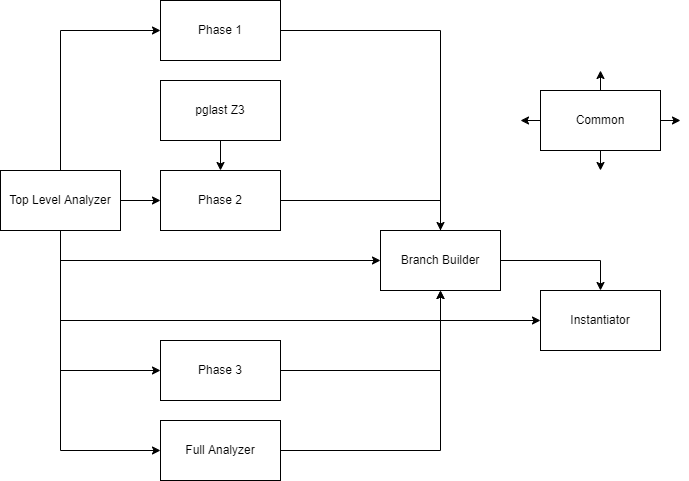

SQL-scope-optimizer
==============

## Overview
The goal  is to take in an SQL query and output faster, equivalent SQL queries. On a high level, it mainly targets inefficiencies arising from join-groupby order and disjunctive conditions. To facilitate coverage, the tool's outputs may not be equivalent to the input query.

The input query is dissected recursively to isolate the SELECT target list or decouple disjunction. Each piece arising from the dissection will be then assembled recursively from its children pieces, each of which may have multiple assembled versions. Each dissection step roughly contains 3 phases: removing irrelevant tables, decoupling disjunctions, and shrinking scope.

Some interesting processing steps may be worth highlighting. There is a module that translates between predicates in AST form and Z3 formulas. A predicate can be translated into a Z3 formula preserving integers, converted to CNF form or context-simplified, and translated back to AST form. Sometimes a predicate will evaluate to false, so we know a query containing this predicate as the filter must return empty and can be omitted as a disjunctive. There is also an algorithm for determining all columns that are functionally dependent on a given set of columns, taking into account all equalities between columns that we know are true.

The tool is a explorative prototype and is not further developed.

## Code structure
The tool is written in python. Relevant parts have been grouped together, and here is the dependency graph of files/classes:

### Top Level Analyzer
Top Level Analyzer is a class that contains utility functions for analyzing a SQL AST tree and only concerns the “top level” details, i.e. does not delve into subselects and sublinks.
### Full Analyzer
Full Analyzer is a class that contains utility functions for analyzing a SQL AST tree and constructs a mapping from table names to AST nodes, children table names (i.e. top-level table names that appear in FROM clause), target list column names, and minimal tuples of target list columns that can form a primary key. 
### Phase 1
Phase 1 computes “table clusters” and removes irrelevant clusters. It also supports checking for two scenarios that end the current round immediately, namely when the remaining side clusters are independent of the center and when no side cluster remains.
### Pglast Z3
This file provides utility functions that translate between AST nodes and Z3 formula and some wrappers for operations on the formulas.
### Phase 2
Phase 2 splits a branch with disjunctions (CASE/WHEN, OR) into different branches.
### Phase 3
Phase 3 checks a branch for two conditions and if any one is satisfied, relevant information will be pushed into a smaller scope and center tables will be deleted.
### Branch Builder
Branch builder processes the query recursively, making use of Phase 1-3, and builds a tree of branches/subbranches. There are two subbranch type: set operation (UNION/INTERSECTION/EXCEPT) and hole.
### Instantiator
Instantiator takes the tree generated by Branch Builder and instantiate actual SQL queries by recursively merging branches.
